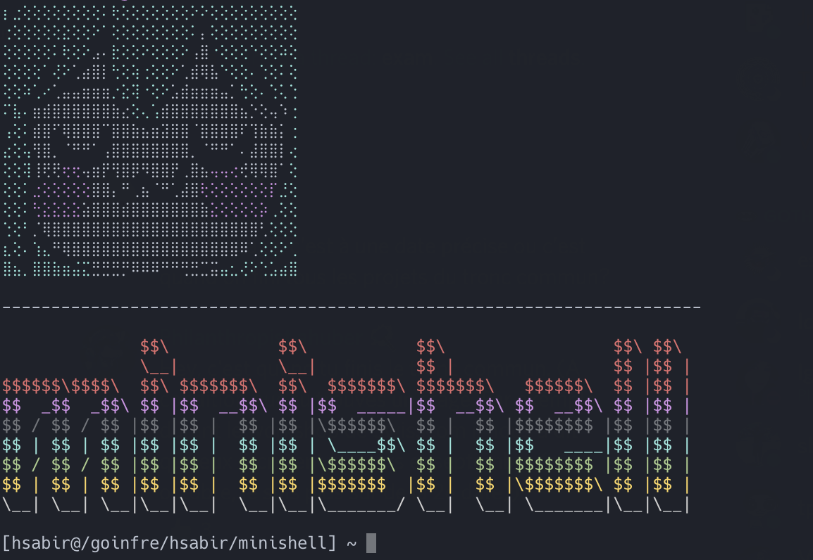

# Minishell

###### The objective of this project is for you to create a simple shell. Yes, your little bash or zsh. You will learn a lot about processes and file descriptors



-----------------------------------

### Implemented with [Leo](https://github.com/lgyger)

### Q - So what is a shell?
As the subject cites : ` The existence of shells is linked to the very existence of IT. At the time, all coders agreed
that communicating with a computer using aligned 1/0 switches was seriously
irritating. It was only logical that they came up with the idea to communicate with
a computer using interactive lines of commands in a language somewhat close
to english.
With Minishell, you’ll be able to travel through time and come back to problems
people faced when Windows didn’t exist.` 

So, basically, a shell is simply a program which simplicify the task of communicating between a user and a machine (Oh yes, it does translate the communication between users and the kernel.), `Finder` on `MAC` and programs like `nautils` on `Linux` or better saying `GNU/Linux` are other examples of shell.


### requirements :
- GNU Make version: 3 above
- GCC version: 4 above
- readline library

### Build
----------------

#### Install readline.
MacOS:
```
brew install readline
```

Linux
- Arch:
```
sudo pacman -Syu readline
```
- Ubuntu and debian based distros:
```
sudo apt-get install libreadline6 libreadline6-dev
```

----------------

Clone this repository.
```sh
https://github.com/0xb1n4r/minishell
```

cd into the minishell directory.

```sh
cd minishell
```

Make

```sh
make
```

Clean the dependencies
```sh
make clean
```

Clean the dependencies + the program
```sh
make fclean
```

Remake everything.
```sh
make re
```

### Usage
Minish is realy simple and yet powerfull, it's made for studies purpose and yet it's enough functional and usefull, it does search and execute program based on the PATH: variable or by using absolute or relative path, it as well contains some [builtin]() commands, please refer to the [man]() section to more detail about comannds.
